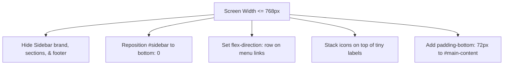

# MATCALL – Mobile Design & Guidelines (skill_mobile.md)

This document provides developer guidelines for maintaining and extending the responsive layout of the MATCALL system, specifically details about the mobile bottom navigation bar layout.

---

## 1. Mobile Layout Architecture

To optimize for one-handed thumb navigation and small screen space, the standard vertical desktop sidebar is transformed into a **fixed bottom navigation bar** on mobile screens ($\le 768\text{px}$).

---

## 2. CSS Design Rules for Mobile Bottom Bar

The following CSS rules in [responsive.css](file:///c:/xampp/htdocs/matcall/css/responsive.css) control this transformation. When modifying or adding navigation pages, ensure these specifications are maintained:

### 2.1 Fixed Bottom Container
The container `#sidebar` is pinned to the bottom.
- **Position:** `fixed`
- **Dimensions:** `width: 100%`, `height: 60px`
- **Flex-direction:** `row`
- **Z-Index:** `1000` (ensures it sits on top of all page elements, including filters and tables)
- **Border-top:** `1px solid rgba(255, 255, 255, 0.1)` for premium design elevation.

### 2.2 Hidden Elements
To save screen space, elements not critical to navigation are hidden:
- `.sidebar-brand` (Logo & Title)
- `.sidebar-section-label` (Section headings)
- `.sidebar-footer` (User badge)
- `#sidebar-overlay` (Sidebar backdrop overlay)
- `#btn-sidebar-toggle` (Slide-out menu hamburger toggle button)

### 2.3 Navigation Link Layout
- **Container (`.sidebar-nav`):** Flexbox row with `justify-content: space-around;` to space the 5 menu links evenly across any mobile screen size.
- **Menu Items (`.nav-item`):**
  - Stacks the icon vertically above the label (`flex-direction: column`).
  - Font size is reduced to `10px` with a label size of `9.5px`.
  - Margin is reset to `0` with standard border-radius resets.

---

## 3. Dynamic Active Highlighting

- **Default State:** Links are colored in transparent/semi-white `rgba(255, 255, 255, 0.65)`.
- **Active State (`.nav-item.active`):** Highlighted with the light Teal color `var(--teal-light)` and a bold weight to draw the thumb directly to the current page.

---

## 4. Layout Precautions for Developers

1. **Overlap Prevention:** Since the bottom bar is `fixed` and has a height of `60px`, developers must ensure `#main-content` has `padding-bottom: 72px !important;` on screens $\le 768\text{px}$. Otherwise, tables, buttons, or charts at the very bottom of the page will be cut off or become unclickable.
2. **Scrolling Behavior:** Ensure all HTML tables inside `.table-wrap` retain scrollable behavior to prevent viewport overflow.
3. **Form Grid Stack:** Form columns must stack vertically in a single column on screens $\le 768\text{px}$ using `grid-template-columns: 1fr;`.
4. **Universal Login Form:** Uses a unified centered login card that scales down to fit small viewports, ensuring forms, icons, and buttons fit perfectly on mobile.
5. **Segmented Tab Control (settings.html):** Navigation tabs in settings are converted into a compact segmented control. On mobile, font size is dynamically reduced to `11px` and padding is minimized to prevent tab wrapping.
6. **Topbar Logout Button:** A dynamic "Logout" button is automatically appended to the top-right corner of the topbar via `js/app.js`. On screens $\le 480\text{px}$, the text "ออกจากระบบ" is hidden, leaving only the door-exit icon to prevent layout clutter.
7. **Super Admin Settings Search & Filter:** On the Settings User Management tab, a search input and plant filter dropdown are rendered for the Central Super Admin to easily manage cross-plant users, which remains hidden for local Plant Admins.

---

## 5. Official Plant Abbreviation Mapping

The system follows a strict mapping of plant codes to official names:
- **PT:** Pathum Thani (ปทุมธานี)
- **KR:** Nakhon Ratchasima (นครราชสีมา)
- **NS:** Nakhon Sawan (นครสวรรค์)
- **SR:** Surat Thani (สุราษฎร์ธานี)
- **CH:** Chonburi (ชลบุรี)
- **NP:** Nakhon Pathom (นครปฐม)

